# E-Kaksha
E-Kaksha is basically a Course Management System, a collection of software tools providing an online environment for course interactions between teachers and students. This Web Application allows the users to manage their assignments, quizzes and course materials all at one place of various courses. It also provides users with a calendar feature with various filters making it easier for students to track their assignments, quizzes and other personal events in their schedules. The realtime chat feature is enabled to make communication between students and teacher effective and effort-less. Attendance feature makes the record of student's presence organized. These various utilities make this application a one-stop solution for users, who generally have to use more than one application for these facilities.

 
Website : https://sweet-starburst-15d15d.netlify.app/ //Currently not working!//

# Screenshots of some webpages

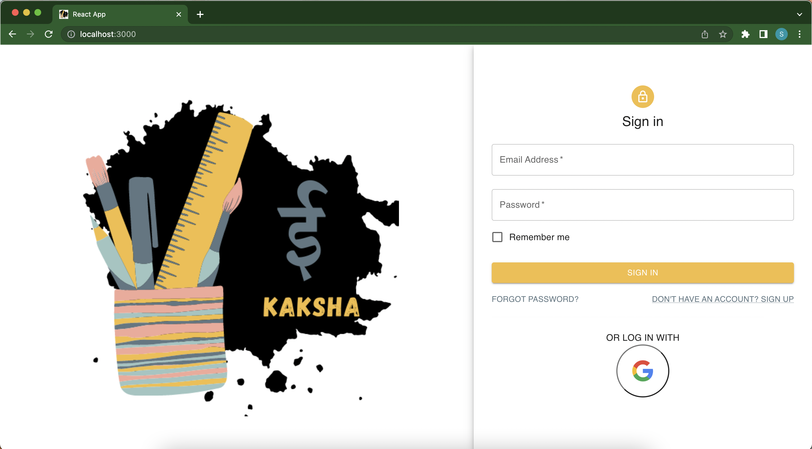
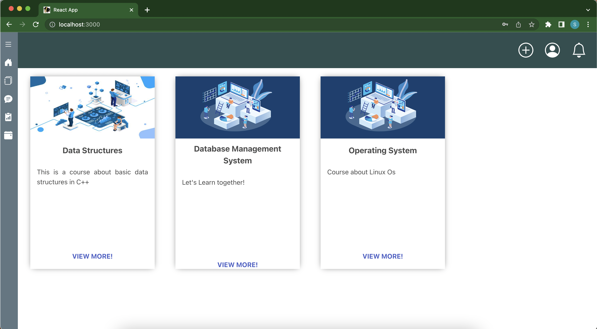
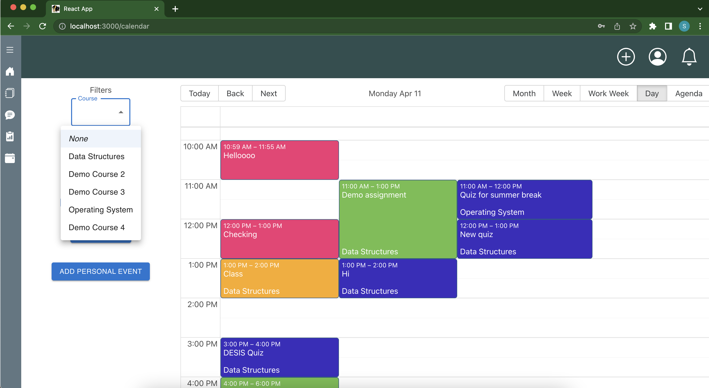
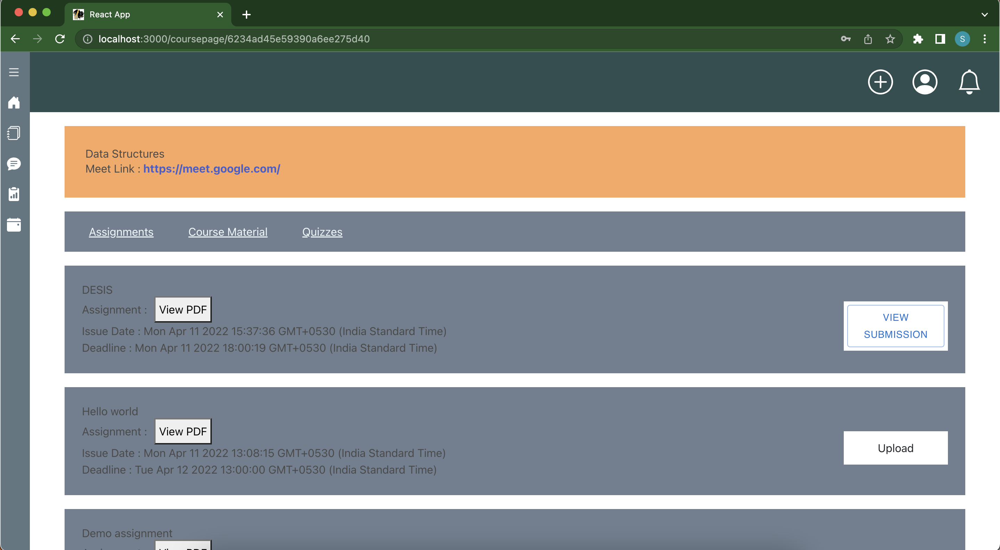
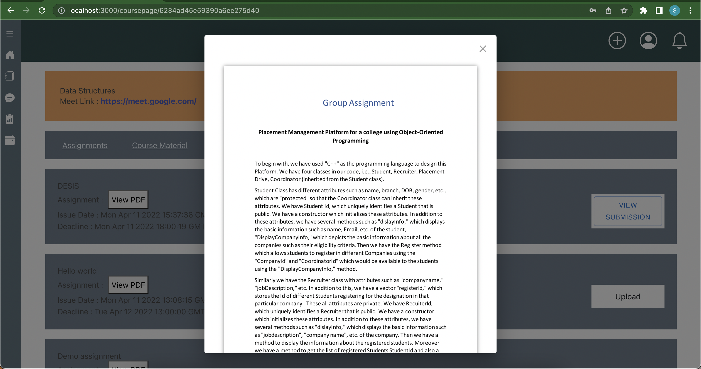
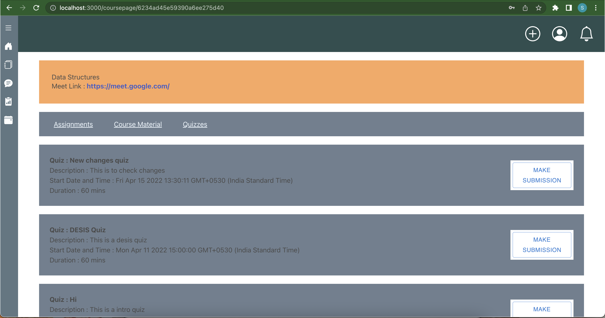
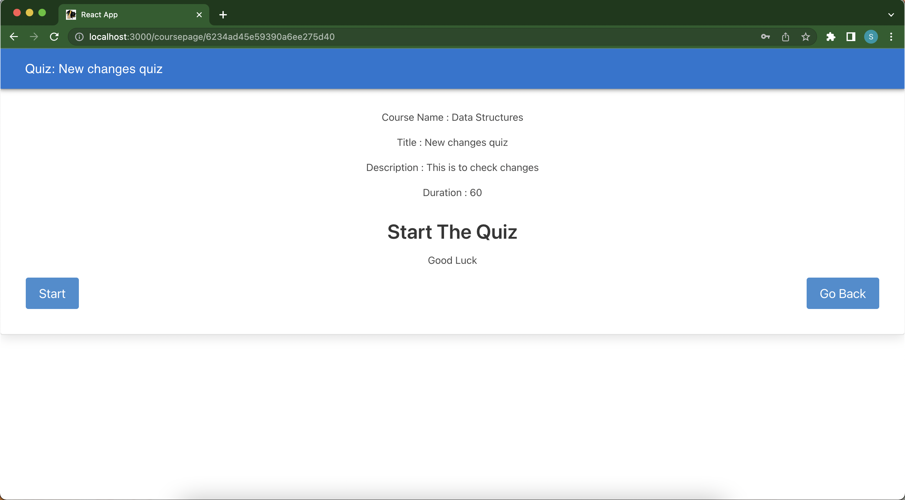
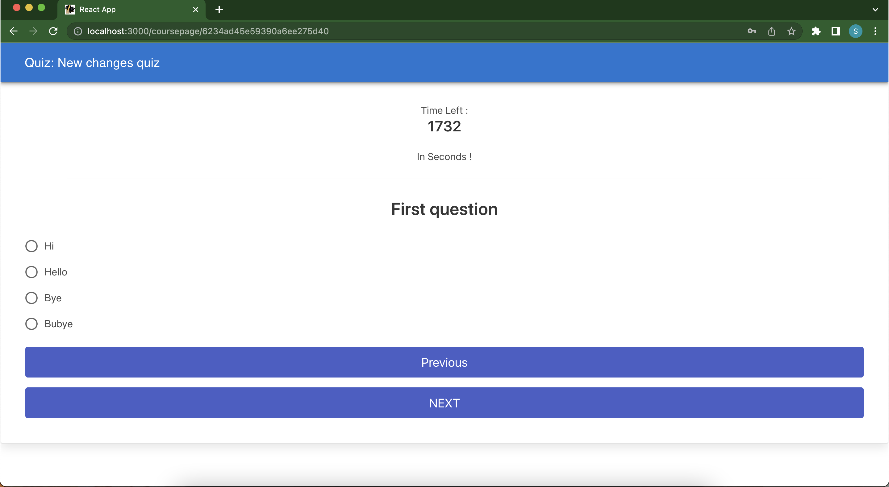
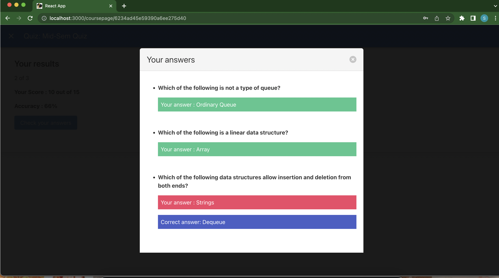
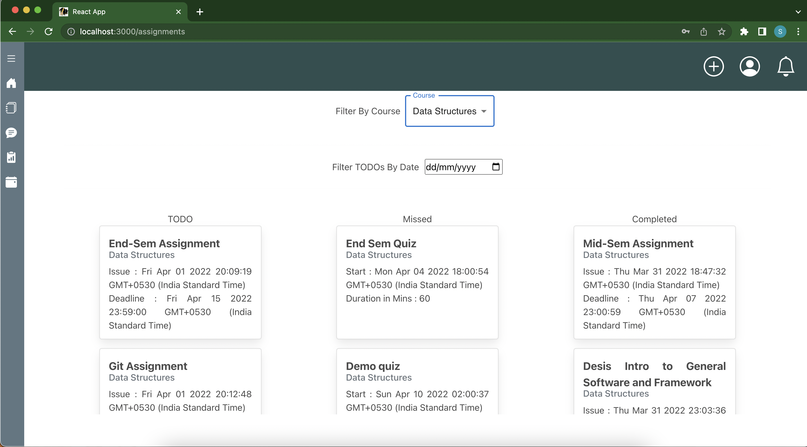
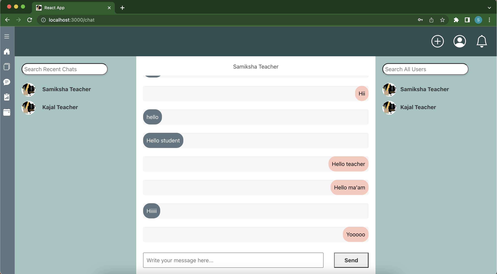
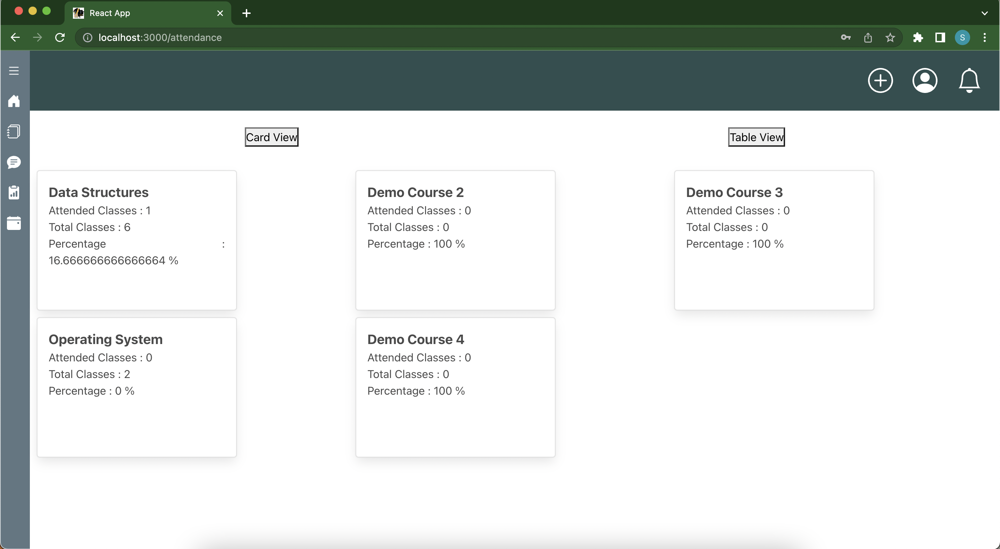
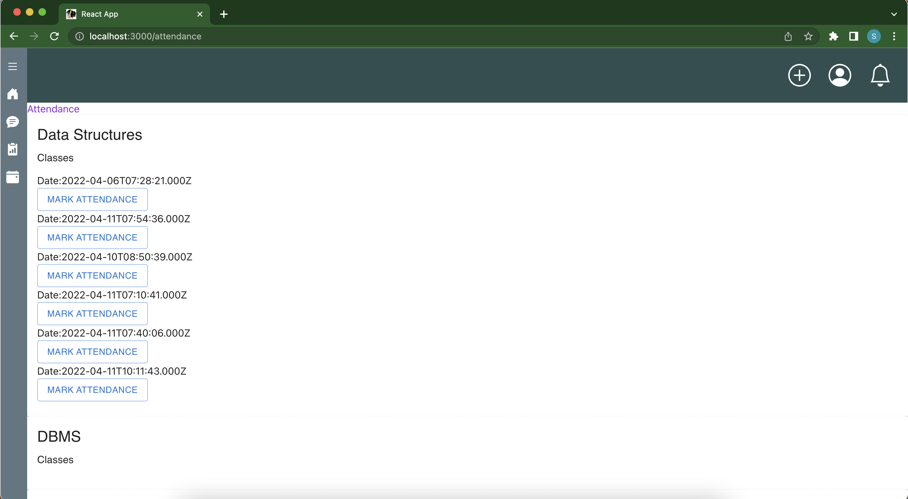
  
## Prerequisites:

One must have nodeJs installed on the system. 
Download Link: https://nodejs.org/en/download/ (Download the LTS version)
## Setting the project on local System

Clone the git repository from the following link: https://github.com/Samiksha-Garg/E-Kaksha and after navigating to the folder run command "npm i"
 
 
Clone the git repository from the following link : https://github.com/Kajal-7/api.git .
Open the project folder on the local system and navigate to the api folder (inside the main folder) using command cd api and run command “npm i”. 
Also add an .env file in the root folder (the api folder inside the main api folder), which will contain : "MONGO_URL = 'YOUR CONNECTION STRING URI' " (Without outer double quotes).
Connection string uri format would be similar to : "mongodb://[username:password@]host1[:port1][,...hostN[:portN]][/[defaultauthdb][?options]]".
To generate the uri, refer the mongodb atlas docs : https://www.mongodb.com/docs/guides/cloud/connectionstring/

 
In the same repository Navigate to socket folder using command cd socket  and run command “npm i”

## How to Start:
Navigate to api folder and then run the command “node index.js”
Navigate to socket folder and then run the command “node index.js”
Navigate to E-kaksha folder and then run the command “npm start” 

